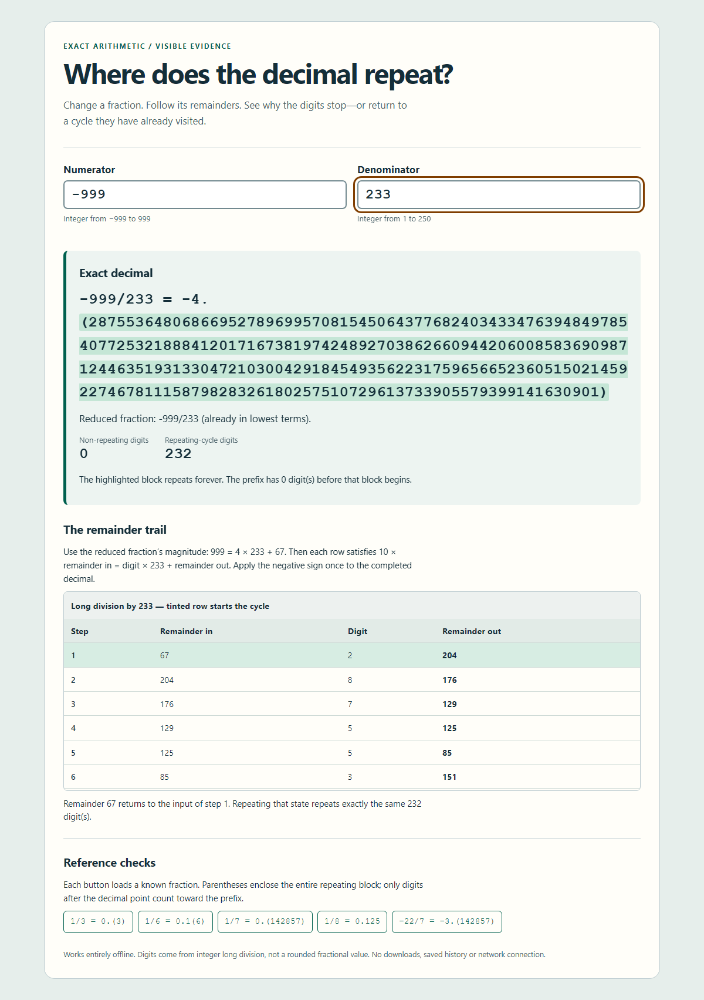
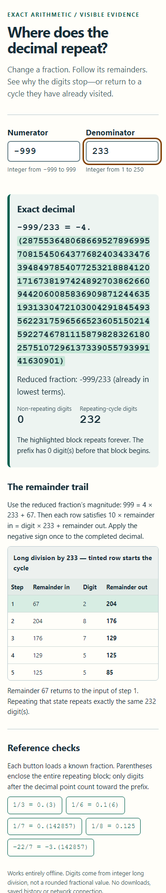

# Decimal cycle inspector

A self-contained HTML/CSS/JavaScript frontend sample. Download `index.html` and open it locally; no server, dependency, external asset, or account is needed.

Enter a fraction to see its reduced form, exact repeating decimal, and remainder trace. The page has native labelled inputs, distinct validation messages, a polite result announcement, visible keyboard focus, and a responsive layout.

AI-authored work originally submitted to a public coding contest. It has not been selected or paid for. It is plain JavaScript, not a React or Next.js implementation, and is not a completed client dashboard.

Verification performed on the submitted file: 499,750 fractions were independently reconstructed with exact integer arithmetic; browser checks exercised the page at 360, 768, and 1200 CSS pixels in Chromium. This does not constitute a complete accessibility audit or a cross-browser certification.

## Desktop

## Mobile

