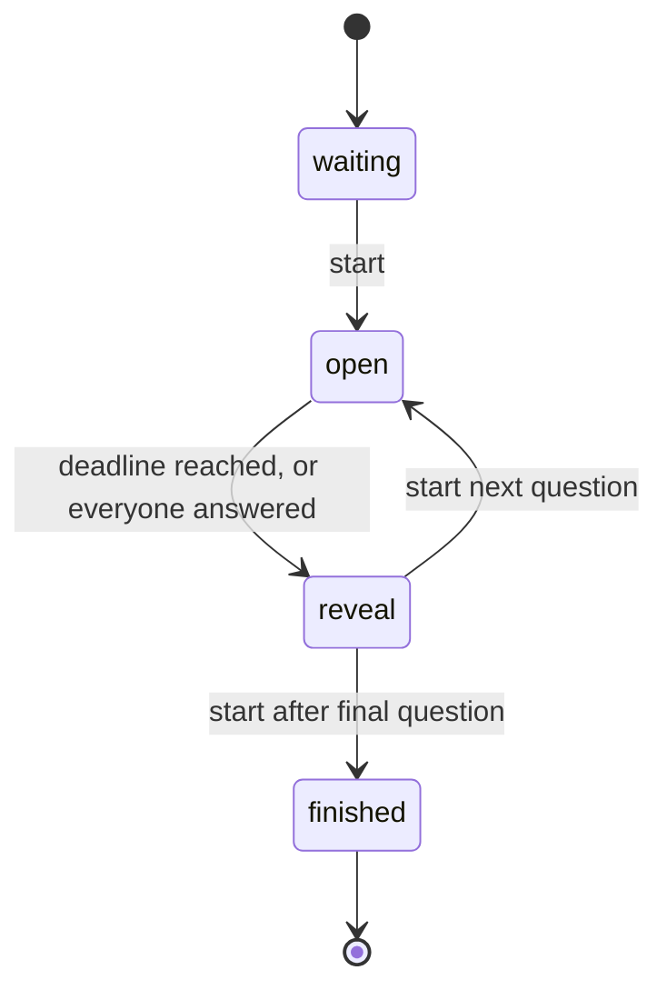

# How the quiz referee works

The referee is a deterministic state machine. Its caller supplies a trusted,
monotonic server timestamp. A language model does not interpret submissions or
decide scores while the program runs.

There is no background timer. The caller must call `tick(now)` to advance an idle
round after its deadline. `submit(...)` also calls `tick(now)` before checking an
answer, so an answer exactly at the deadline is rejected even if the caller has
not yet delivered a timer event.

## Calls and observable results

| Call | Behavior |
|---|---|
| `start(now)` | Opens the first or next question from `waiting`/`reveal`. After the last reveal, changes to `finished`. Raises `ValueError` in `open` or `finished`. |
| `tick(now)` | Updates the monotonic clock check; changes an expired open round to `reveal`; returns the public snapshot. |
| `submit(player, question_id, choice, now)` | Advances the timer, validates the event, records at most one answer per player for that question, returns a status string. |
| `snapshot()` | Reads public round state without advancing time. Includes question text, choices, deadline and answer count once a question exists. Correct answer and scores appear only in `reveal`/`finished`. |

Every time-taking call checks a finite, nondecreasing timestamp. Repeated equal
timestamps are allowed. Invalid lifecycle calls can still advance the internal
clock check before raising; a caller must not retry them with an earlier time.

Submission statuses are checked in this order:

1. `closed`: the round is not open after advancing time.
2. `unknown-player`: the player is not on the fixed roster.
3. `stale-question`: the ID is not the current integer question index.
4. `already-answered`: this player has already used their answer.
5. `invalid-choice`: the choice is not an integer index into the question's choices.
6. `accepted`: the answer was recorded. This does not tell the caller whether it
   was correct. A correct answer adds 100 points internally.

If all rostered players answer, the round ends immediately. The next snapshot may
then expose the answer and scores because the answer window has ended for everyone.

## Walk through the recording demo

The first question starts at timestamp0 with a15-second duration and two players.
Blue answers correctly at2: accepted. Blue's second submission at3 is rejected.
Gold answers at15: closed. The reveal shows Blue100, Gold0. A new question starts
at16; Gold's packet naming question0 at17 is rejected as stale. The new question
still has zero accepted answers.

Those are actual scenarios implemented in `challenge.py`. They are illustrative
checks, not a claim that every possible event sequence has been tested.

## Where the trust boundary belongs

The host object belongs on the server. The caller must keep its question bank,
correct answers and score fields private and expose only deliberately selected
snapshots/results. Reading Python object internals in the same trusted process is
not prohibited by this toy implementation; exposing those internals to clients
would break the intended boundary.

For a network adapter, authenticate the player independently of a submitted name,
take time from a server-owned monotonic clock, validate message shapes, and
serialize calls. Do not trust a client's timestamp, identity or score. Add rate
limits and a deliberate departure/reconnection policy. The sample has a fixed
roster and no transport, persistence or concurrent-request protection.

Question definitions and host state are trusted application configuration.
Python's dataclass type annotations are not a runtime validation schema for
arbitrary JSON. Validation of externally supplied questions is separate work.

## What to review next

An independent reviewer can inspect the specified event order, the distinction
between internal state and public views, and whether the desired product rules
actually match these rules. New tests should capture a distinct behavior or a
reproducible failure rather than restating the implementation line by line.

For a report, provide a small local script, the expected result, actual output,
Python version and commit. A missing production feature already disclosed above
is a design task; a contradiction of the stated sample behavior is a bug to
reproduce. Either can be discussed without trying anything against a live game.
